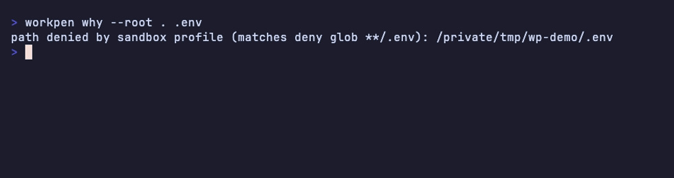

<p align="center">
  
</p>

# Workpen

[](https://github.com/workpen/workpen/actions/workflows/ci.yml)
[](https://github.com/workpen/workpen/actions/workflows/security.yml)
[](https://crates.io/crates/workpen)
[](https://docs.rs/workpen)
[](https://github.com/workpen/workpen/releases/latest)

[](./LICENSE)
[](https://www.bestpractices.dev/projects/14736)
[](https://securityscorecards.dev/viewer/?uri=github.com/workpen/workpen)
[](https://github.com/workpen/workpen/actions/workflows/fossa.yml)

Dest-deny and a per-child process jail. The parent is trusted. The
child is not. This is not a VM.

## Install

Library:

```toml
workpen = { version = "0.5", features = ["gc", "nono"] }
```

CLI:

```bash
cargo install workpen-cli --locked
```

Git pin:

```toml
workpen = { git = "https://github.com/workpen/workpen", tag = "v0.5.0", features = ["gc", "nono"] }
```

MSRV is 1.95.

## CLI

```bash
workpen why --root . .env
workpen run --root . -- /bin/echo ok
```



`workpen run` dest-denies argv first, then jails the child. Unix
`--tty` gives the child a PTY. Windows `--tty` refuses. A copy-paste
run is [examples/run-echo.sh](examples/run-echo.sh).

Commands: `why`, `run`, `gc`. `workpen --help` prints usage.

## Library

```rust
use std::path::Path;
use workpen::{DenyPolicy, is_path_denied};

let policy = DenyPolicy::default();
assert!(is_path_denied(Path::new(".env"), &policy));
```

Kernel jail (feature `nono`): `process_jail` then `run_child`. PathGuard
refuses `/` and `$HOME` as the workspace or extra-root. Leftover
worktree GC is feature `gc`.

Crate rustdoc is canonical: `workpen::threat_model`. The same contract
in one page is [docs/threat-model.md](docs/threat-model.md).

## Limits

- Linux remount skip: `workpen run` does not spawn. Library `run_child`
  still starts the child (`RemountSkipped`) unless you opt into
  `with_require_dest_hide`.
- Nested Linux post-create (`mkdir x && touch x/.env`) is a launch
  snapshot. Workspace-root missing dest-deny names are occupied when
  remount applies.
- Windows WFP without admin is skipped (`WfpSkipped`). AppContainer
  with no network capabilities is the unelevated net deny.
- Do not vendor bubblewrap.

## Contributing

See [CONTRIBUTING.md](CONTRIBUTING.md). DCO sign-off required.
Security: [SECURITY.md](SECURITY.md).

## License

MIT OR Apache-2.0.
